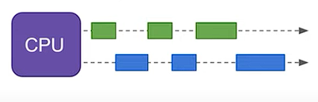
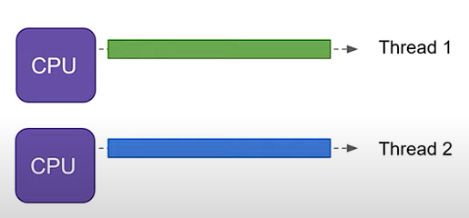
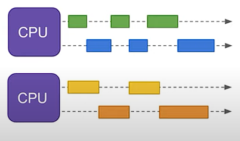
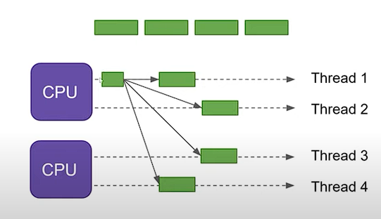

# O que é Elixir?

[Elixir](https://elixir-lang.org/) é uma linguagem de programação funcional brasileira que foca em paralelismo e concorrência por meio de processos isolados.

----------

## História do Elixir

- Criado em 2012 por José Valim
- Construído por cima do Erlang
  - Rodam os sistemas de telefonia digital
  - Concorrência
  - BEAM: máquina virtual do Erlang
    - Supervisionamento de processos: tolerância a falhas (modelo de Atores)

----------

## Instalando elixir

É recomendado usar o asdf para pode utilizar várias versões diferentes do elixir com menos problemas, o tutorial de texto está nas fontes

----------

## O que é uma linguagem de programação funcional e qual a diferença entre orientada a objetos?

### Programação funcional

O código parece mais funções matemáticas, por exemplo: $f(x) = x + 5$

Tendo a característica de:
- Operações e dados imutáveis
- Sem efeitos colaterais (gerar efeitos fora do escopo da função), ou seja maior entendimento das operações e menos bugs
- Fluxo de controle restrito, ou seja, `entrada -> processamento -> saída`
- Funções podem ser compostas

> Melhor para quando tem operações pouco definidas e coisas definidas

#### E imperativa

```
def soma_potencia(a, b, pot) do
    soma = a + b
    soma_pot = soma ^ pot
    return soma_pot
end
```

- Cria variáveis e guarda valores na memória do computador, gerando efeitos colaterais
- É uma função impura

#### Puramente funcional

```
def soma_potencia(a, b, pot) do
    return (a + b) ^ pot
end
```

- Não cria variáveis, então sem efeitos colaterais
- É uma função pura

### Programação orientada a objetos

Objetos tem uma planta (classe) com características bem definidas, que podem ser reutilizdas

Tendo a característica de:
- Reutilização de características e métodos (ações) de classes
- Objetos de mesma classe podem guardar dados diferentes

> Melhor para quando tem operações bem definidas e coisas pouco definidas

1. Criar as classes
```
classe Animal:
    Animal.cor_pelo
    Animal.nome
    Animal.sexo
    Animal.idade
    Animal.mudarNome()

classe Gato:
    extende Animal
    Gato.raça
    Gato.comida_favorita
    Gato.escalar()

classe Pato:
    extende Animal
    Pato.nadar()
```

2. Criar objetos
```
gato1 = criar Gato("azul", "gilbert", "M", "70", "gato do deserto", "óleo de atum enlatado")
pato1 = criar Pato("verde", "Phoebe", "F", "22")
```

3. Usar métodos
```
gato1.mudarNome("Jonny")
gato1.escalar()

pato1.mudarNome("Jojo")
pato1.nadar()
```
- O método mudarNome recebe um parâmetro e tem como efeito colateral alterar o objeto Animal 

----------

## O que é paralelismo e concorrência?

- Uma CPU consegue fazer uma coisa de cada vez


### Concorrência



Ter progresso em várias tarefas, quase ao mesmo tempo, em uma CPU
- As tarefas são separadas em threads e quebradas em pedaços
- A CPU troca de thread e faz progresso em cada pedaço

### Execução em paralelo



Rodar duas tarefas ao mesmo tempo, em CPUs diferentes
- Cada CPU foca em sua tarefa em sua thread

### Executando paralelamente em concorrência



Rodar 4 tarefas em duas CPUs

### Paralelismo



Quebrar uma tarefa menor em várias tarefas menores
- Vale a pena quebrar as tarefas de acordo com a quantidade de CPU, porque evita rodar concorrencia e tomar mais tempo

----------

## Processos isolados?

TODO: Adicionar isso depois

----------

# Fontes
- [Programação funcional e programação orientada a objetoes](https://www.youtube.com/watch?v=08CWw_VD45w)
- [Concorrência vs paralelismo](https://www.youtube.com/watch?v=Y1pgpn2gOSg)
- [Alquimia Stone: Aula 1.1](https://www.youtube.com/watch?v=WRGvPgCHMfI)
- [Instalando Elixir com o asdf](https://thinkingelixir.com/install-elixir-using-asdf/)